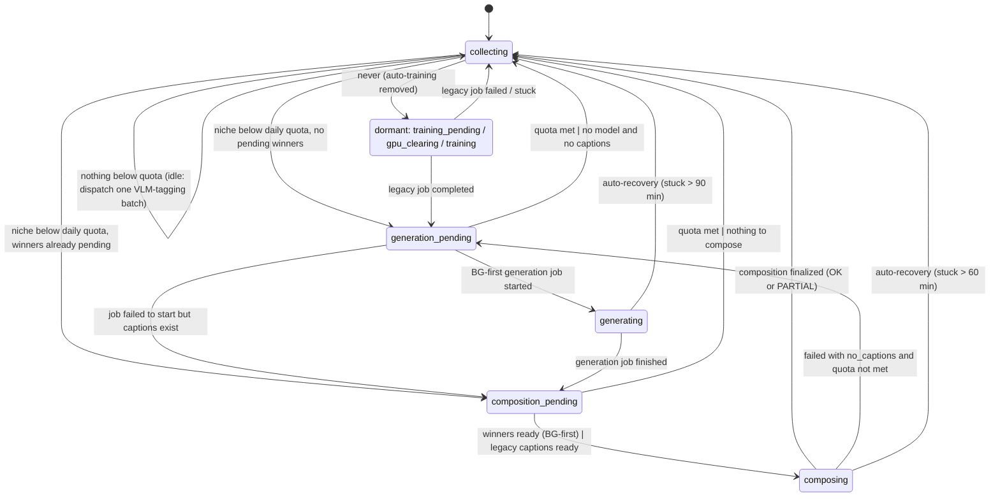

# Pipeline Orchestrator State Machine

The orchestrator ([tasks/pipeline_orchestrator.py](../tasks/pipeline_orchestrator.py)) automates per-niche caption generation and video composition. It runs every 5 minutes from Celery Beat (`pipeline-orchestrator`, `maintenance` queue) and is gated by the Redis flag `pipeline:enabled` (default off; `POST /pipeline/enable`).

State lives in Redis (`pipeline:state`, `pipeline:state_timestamp`, `pipeline:current_niche`) and every transition is appended to the `pipeline_state_log` table with a reason and metadata.

> **Training is not part of the loop.** LoRA training is manual (`POST /training/trigger/{niche}`, see [training_runbook.md](training_runbook.md)). `get_next_niche_needing_training()` always returns `None`, so the `training_pending → gpu_clearing → training` branch is **dormant**. The states are kept only so a job started by an older deploy can still drain through the recovery paths.
>
> The live loop is `collecting → generation_pending → generating → composition_pending → composing → collecting`.

## State diagram



```
   ┌────────────────────────────────────────────────────────────────────────────┐
   │                                                                            │
   ▼                                                                            │
COLLECTING ──below quota, winners pending──▶ COMPOSITION_PENDING ──▶ COMPOSING ─┤
   │                                                ▲                    │      │
   │ below quota, no winners                        │                    │      │
   ▼                                                │                    │      │
GENERATION_PENDING ──job started──▶ GENERATING ─────┘        no_captions │      │
   │                                                                     ▼      │
   └──────────────────────────────────────────────────────────── GENERATION_PENDING
```

## States

### COLLECTING (idle / normal operation)

Everything runs: scraping, OCR extraction on both GPUs, LLM batch refinement and judging, watermark filtering, background scraping.

Each tick:
1. `get_next_niche_needing_training()` — always `None`.
2. `get_niche_below_daily_quota()` — picks the enabled niche with the lowest `composed_today / daily_video_target` ratio (round-robin by progress). If found:
   - if that niche already has `caption_candidates` rows in `winner` or `composing` status → **COMPOSITION_PENDING** (`winners_already_pending`) — compose leftovers before generating more;
   - else → **GENERATION_PENDING** (`quota_below_target`).
3. Otherwise stay, re-enable extraction, and dispatch **one** VLM-tagging batch (`_maybe_dispatch_tagging_batch`, batch 100) if `ml_tagging:enabled` is set and no batch is running. Tagging swaps llama-server to the VLM profile and back, so it only runs when nothing else wants the GPUs.

### GENERATION_PENDING

- Safety check: `daily_quota_met(niche)` → back to **COLLECTING**.
- Otherwise disable GPU workloads (OCR, tagging, watermark filter), purge the `gpu` queues, unload in-container models so llama-server has the GPUs, then `start_generation_job(niche)`:
  - `BG_FIRST_GENERATION=true` (default): dispatch a BG-first job — `BG_FIRST_BGS_PER_CYCLE` (30) untargeted, niche-compatible backgrounds × `BG_FIRST_CANDIDATES_PER_BG` (10) candidates each, judged inline, best pass promoted to `winner` and mirrored into `generated_captions`.
  - `false`: legacy blind `run_generation_job` (100 captions, heuristic scoring).
- Started → **GENERATING**. Failed to start (no adapter, too many consecutive failures) → **COMPOSITION_PENDING** if approved captions exist, else **COLLECTING**.

### GENERATING

Waits for the job to reach `completed` / `failed` / `cancelled` (`generation_complete`). On completion: score captions, clear the job pointer, re-enable GPU workloads, force-unload models → **COMPOSITION_PENDING**. Stuck > 90 min → the job is auto-failed and state returns to **COLLECTING**.

The inline judge ([tasks/caption_judge.py](../tasks/caption_judge.py)) scores `grammar`, `flow`, `bg_consistency`, `appeal`, `overall` (1–10); pass = every axis ≥ 7. Failed candidates never become winners; `_judge_filter()` also keeps actively-failed rows out of legacy composition.

### COMPOSITION_PENDING

1. `daily_quota_met` → re-enable GPU workloads → **COLLECTING** (`daily_quota_met`).
2. BG-first (default): disable GPU workloads and purge the `gpu` queues so compose tasks are not stuck behind OCR, then `start_bg_first_composition_job(niche)` — one `compose_single_video_task` per (winner, background) pair, up to the remaining quota; candidates move to `composing` → **COMPOSING** (`bg_first_winners_ready`).
3. No winners: fall back to legacy `ready_for_composition` (≥ `min_captions_for_batch` approved captions with `quality_score ≥ min_quality_score_for_composition`, plus eligible backgrounds) → **COMPOSING**, otherwise re-enable workloads → **COLLECTING** (`not_ready_for_composition`).

### COMPOSING

`composition_complete_with_reason` polls the parent `video_composition_jobs` row. Legacy jobs update their own status. BG-first jobs never do, so the orchestrator **finalizes** them by counting `composed_videos` rows for the job:

| Condition | Result |
|---|---|
| `composed_count >= target_count` | `completed` (OK) |
| At least one mp4, but > 240 s since the last one landed | `completed`, `videos_failed = target − composed` (PARTIAL) |
| No mp4 at all 1800 s after dispatch | `failed` (`no composed videos produced`); `composing` candidates restored to `winner` |

On finalize, `composing` candidates whose text made it into a composed video become `composed`; the rest go back to `winner` for the next cycle. Then:
- failure reason `no_captions` and quota not met → **GENERATION_PENDING**;
- otherwise re-enable all GPU workloads, clear the current niche → **COLLECTING** (`composition_complete` or `composition_failed:<reason>`).

Stuck > 60 min → auto-recovery to **COLLECTING**.

### Dormant: TRAINING_PENDING → GPU_CLEARING → TRAINING

Legacy in-container training path (disable GPU workloads → wait for extraction to drain → unload models until GPU memory < 2 GB → run the job). No fresh transition enters it. If an old deploy left the state there, the tick either finds the job completed (→ **GENERATION_PENDING**), failed (→ **COLLECTING**), or stuck past the timeout (→ **COLLECTING**).

## Stuck-state timeouts

`MAX_STATE_DURATION_MINUTES` — if a state lasts longer than this, the next tick runs auto-recovery instead of the normal branch:

| State | Max minutes |
|---|---|
| `generation_pending` | 10 |
| `generating` | 90 |
| `composition_pending` | 10 |
| `composing` | 60 |
| `training_pending` / `gpu_clearing` | 30 |
| `training` | 240 |

## Transition summary

| From | To | Reason logged | Side effects |
|---|---|---|---|
| collecting | generation_pending | `quota_below_target` | set current niche |
| collecting | composition_pending | `winners_already_pending` | set current niche |
| generation_pending | generating | `generation_job_started` | disable GPU workloads, purge gpu queues, unload models |
| generation_pending | composition_pending | `generation_failed_but_captions_available` | re-enable workloads |
| generation_pending | collecting | `daily_quota_met:skip_generation` / `generation_start_failed` | re-enable workloads |
| generating | composition_pending | `generation_complete` | score, unload models, re-enable workloads |
| generating | collecting | `auto_recovery:stuck_generating` | job marked failed |
| composition_pending | composing | `bg_first_winners_ready` / `ready_for_composition_after_purge` / `ready_for_composition` | disable workloads + purge (BG-first) |
| composition_pending | collecting | `daily_quota_met` / `not_ready_for_composition` | re-enable workloads |
| composing | collecting | `composition_complete` / `composition_failed:<reason>` | finalize job, reconcile candidates, re-enable workloads |
| composing | generation_pending | `no_available_captions:need_more_generation` | — |
| any | collecting | `auto_recovery:stuck_in_<state>` | — |

## Per-niche configuration

Each entry in `NICHE_CONFIGS` ([config/automation_config.py](../config/automation_config.py)):

```yaml
motivation:
  enabled: true
  subreddits: [GetMotivated, Motivation, quotes, DecidingToBeBetter]   # caption sources
  keywords: [motivation, discipline, mindset, habits]
  daily_video_target: 30
  generation_temperature: 0.85
  generation_repetition_penalty: 1.5
  postpone_reddit_username: motivation_clips
```

Background eligibility per niche comes from [config/niche_rules.py](../config/niche_rules.py) (`NICHE_SUBREDDITS` allow-list + `NICHE_TAG_RULES` over the VLM tags).

| Niche | Caption sources | Background subs | Daily target |
|---|---|---|---|
| motivation | GetMotivated, Motivation, quotes, DecidingToBeBetter | naturegifs, oddlysatisfying, aviation, hiking | 30 |
| fitness | Fitness, bodyweightfitness, xxfitness, running | gymmotivation, running, climbing, calisthenic | 30 |
| cooking | Cooking, recipes, MealPrepSunday, EatCheapAndHealthy | gifrecipes, foodvideos, baking, cooking | 30 |
| travel | travel, solotravel, digitalnomad, backpacking | travelvideos, dronevideos, citybreaks, roadtrip, vandwellers | 30 |

Daily quotas are counted in Redis (`pipeline:quota:<date>:<niche>:composed`) and reset at midnight UTC; `POST /pipeline/quotas/{niche}/reset` clears today's count.

## Error handling

Any exception inside a tick is logged with a traceback, `ensure_extraction_enabled()` restores GPU workloads, and the state is left unchanged so the next tick re-evaluates it. Consecutive generation failures per niche are counted (`MAX_CONSECUTIVE_FAILURES = 3`); `GET /pipeline/failures` shows them and `POST /pipeline/failures/{niche}/reset` clears them.

## API

| Method | Path | Description |
|---|---|---|
| GET | `/pipeline/status` | Full status for every niche (quota, captions, adapter) |
| GET | `/pipeline/state` | Current state, current niche, duration |
| POST | `/pipeline/enable` / `/disable` / `/pause` / `/resume` | Toggle the loop |
| POST | `/pipeline/reset` | Force state back to `collecting` |
| POST | `/pipeline/trigger/generate/{niche}` | Jump to `generation_pending` for a niche |
| POST | `/pipeline/trigger/compose/{niche}` | Jump to `composition_pending` for a niche |
| POST | `/pipeline/trigger/score/{niche}` | Re-score a niche's generated captions |
| GET | `/pipeline/quotas`, `/pipeline/quotas/today` | Quota progress |
| POST | `/pipeline/quotas/{niche}/reset` | Reset today's count |
| GET | `/pipeline/jobs/active`, `/pipeline/jobs/{niche}` | Active / historical job ids |
| GET | `/pipeline/history`, `/history/stats`, `/history/timeline` | `pipeline_state_log` views |
| GET | `/pipeline/state-machine` | Machine-readable definition of the states above |
| GET | `/pipeline/failures`, `/pipeline/failures/{niche}` | Consecutive-failure counters |
| GET | `/pipeline/config`, POST `/pipeline/config/reload` | Automation config |

The deploy workflow reads `/pipeline/state` and `/pipeline/jobs/active` before restarting containers and skips the GPU workers while the state is `generating`, `composing`, or `training`.
